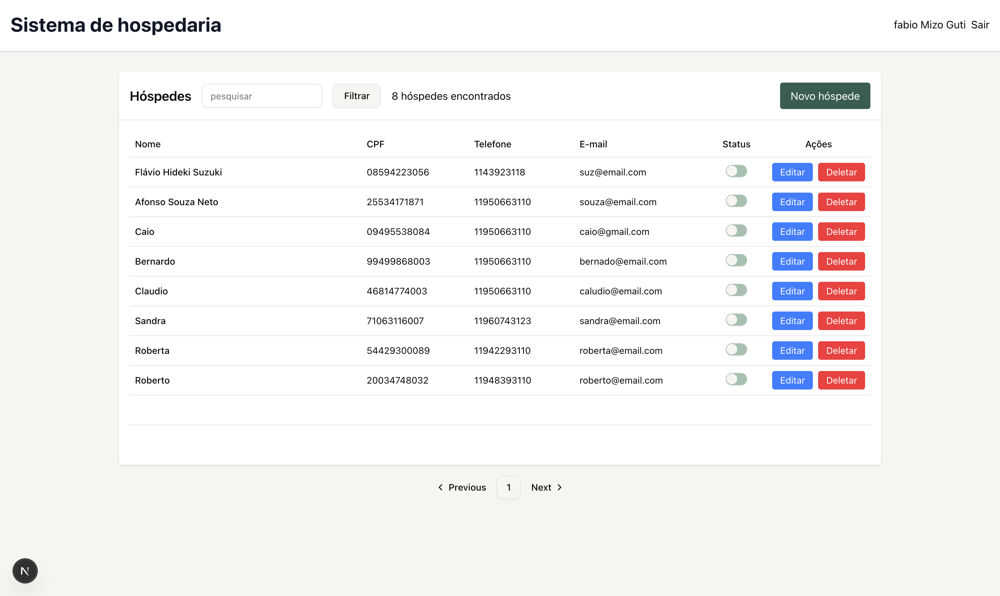

# Sistema de Hospedagem

É um CRUD de hóspedes para a disciplina de Engenharia de Software. Ele também foi usado como POC de algumas funcionalidades como busca por similaridade e ABAC.

## Técnologias utilizadas

### Frontend
- Next
- Axios
- Tailwind
- TypeScript
- React
- NextAuth

### Backend
- Java
- Jackson
- PostgreSQL
- Keycloak
- docker

## Como executar

### Frontend
- npm run dev

### Backend 
link do reposiório: [link do reposiório](https://github.com/fabiomizoguti/sistema-hospedaria)

- docker compose up -d
- crie o realm: sistema-hospedaria e o cliente sistemahospedaria
- Adicione um usuário e as roles hospede:status, hospede:edit, hospede:delete
- mvn exec:java -Dexec.mainClass="com.fabiok.sistemahospedaria.App

